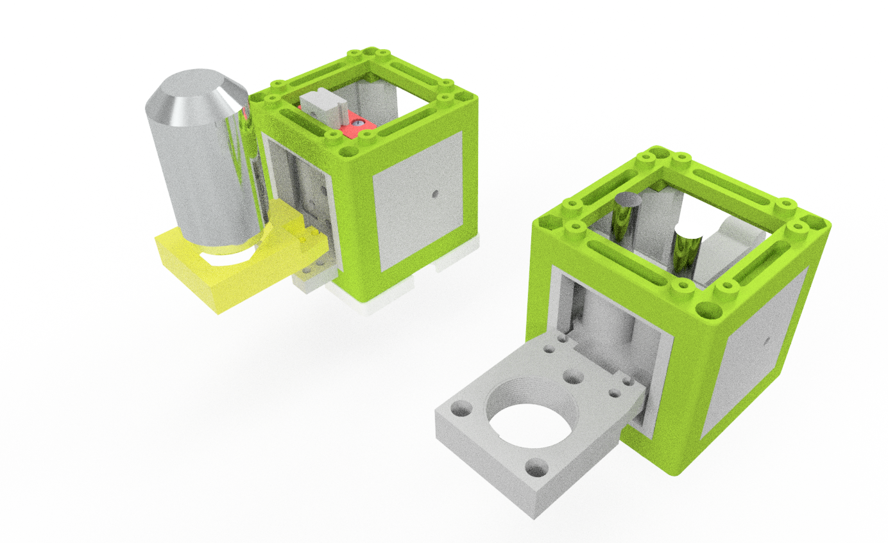
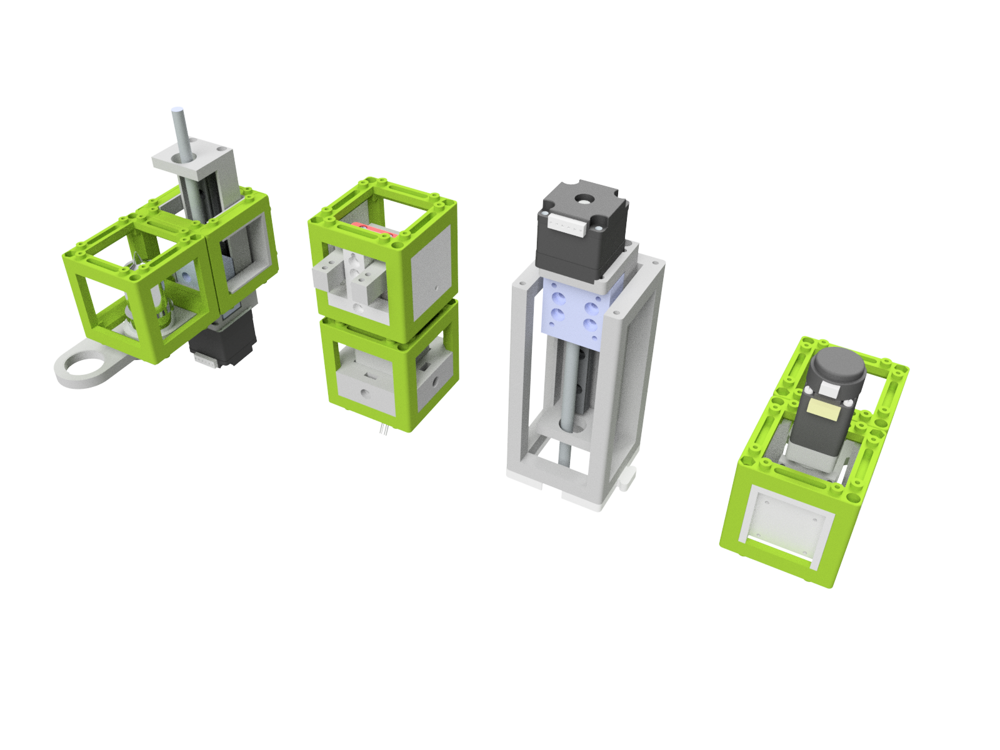
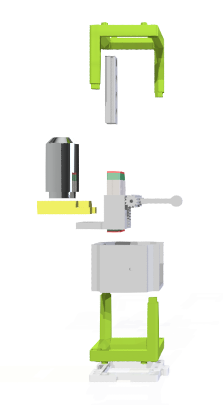
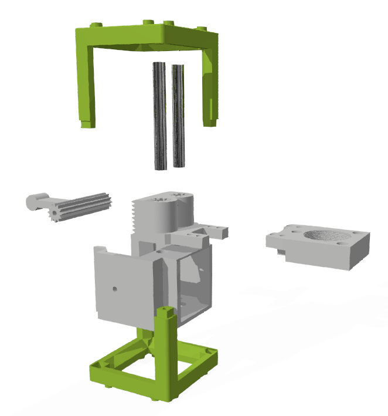
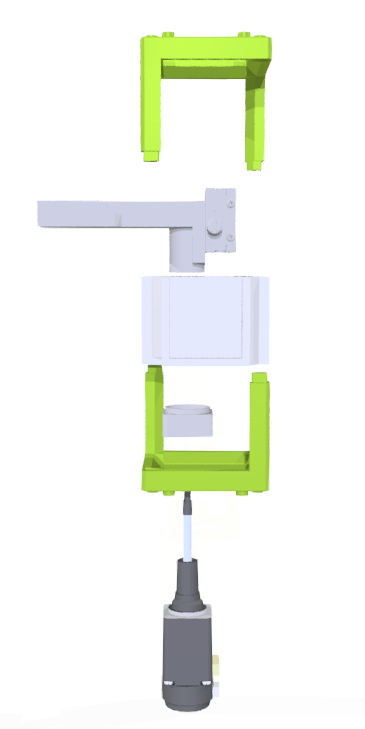
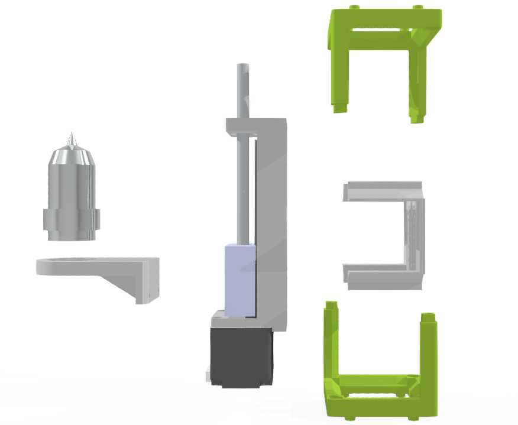

# openUC2 Linear Focussing Stage 
 

This repo will help you to integrate linear motion into a cube. We have multiple different solutions depending on precision, price and available components. Some are motorized, others are purely manually driven. 

## Manually-driven Z-stage

The idea is to have a small level arm that is equipped with a one-sided gear that translates a rotation into a linear motion. The linear motion is quided either using a CNC-derived linear bearing (i.e. MGN12H) or a rod-based linear rail system, where a 5mm rod in combination with a dry linear bearing (similar to Igus drylin, but 3D printed) assures linear motion along the optical axis. 

Both versions are thought to be used for beginner purposes and for low magnification lenses since the overall accuracy is not very high.

## Motorized Z-stage

For automated micrsocopy applications it is important to have a stable focus that can be moved to compensate focus variatins and for focus stacking. We make use of several different versions, where one relies on an off-the-shelf linear actuator (50mm rail with NEMA11 stepper motor) that integrates in the cube either in an inverted or upright system. 

Alternatively we also offer a linear stage derived from a 25mm linear bearing that can be operated manually with its micrometer screw or pushed by a non-captive linear motor (NEMA8, Nanotec). This is by far the most precise, but also the most expensive solution. 

The last DIY-lovers version relies on off-the-shelf parts (e.g. 3D printed, ebay) only. It features a NEMA11 motor in combination with a DIY non-captive linear motion that is guided by a MGN12H linear bearing. Though it's readily available it may suffer from certain imprecisions.

Below we will briefly show you how to build the modules. 

***Features:***
* Linear Z-motion
* manual and automated operation
* Low-cost
* Integrate into the UC2 system
* Mount RMS-threaded lenses

## In-Action

Here you can see a z-stack acquired with the UC2 linear stage:

# Software

## Firmware 

The laser control and motion of the filter is done by the [UC2-REST](https://github.com/openUC2/UC2-REST) firmware. It is a work-in-progress and we suggest you to reach out to us through an issue when you're keen on using the software

## GUI/Controlsoftware

We forked the beautiful [ImSwitch](https://github.com/kasasxav/ImSwitch/) and adapted many functionalities (e.g. Filter swtichting) into their framework. The [beniroquai fork](https://github.com/beniroquai/ImSwitch/) implements the above mentioned Firmware [UC2-REST](https://github.com/openUC2/UC2-REST). Also here: It is a work-in-progress and we encourage you to reach out to us if you need help. :-)

## Python Code

A ESP32-Python client to control the motors that are connected to e.g. the CNC-Shield v3 can be found here [ESP32Client.py](https://github.com/openUC2/UC2-REST/blob/master/PYTHON/ESP32Client.py).

# Hardware - Manual Z-stage (MGN12H)

**Figure 1:** *A ~50mm long MGN12H linear bearing/rail integrates into the cube to have a stable motion along the optical axis*

The rail mounts to the base and the objective mount adapts to the acutal linear bearing. This piece also has a linear set of gear tooths that in combination with the geared level arm allows a linear motion when pulling the levelarm up and down. 

The assembly porcess is straight forward. Even though not shown in the diagram, you only need to add M3 screws to mount the linear rail to the base and then the objective mount to the linear rail. The level arm is also mounted to the base with two M3 screws in order to allow a rotation. 

This is only a rough description of the assembly process. If you need additional information please have a look the core [openUC2 repository](https://github.com/openUC2/UC2-GIT) or file an issue.

## Bill of material

Below you will find all components necessary to build the beamcombiner

### 3D printing files

All these files in the folder [./STL/](./STL/) need to be printed. We used a Prusa i3 MK3 using PLA Prusament (Galaxy Black) at layer height 0.3 mm and infill 30%.

For the RMS-threaded objective mount you should use higher printing resolution, e.g. 0.1mm.

Additionally you need 1x IM Cube.

### Additional parts
This is used in the current version of the setup

|  Type | Details  |  Price | Link  |
|---|---|---|---|
| Linear Bearing | [MGN12H](ebay.com) |  10 € | [ebay.com](ebay.com)  |
| Linear Rail | 50mm, for the MGN12H |  10 € | [ebay.com](ebay.com)  |

### Design files
The original design files are in the [INVENTOR](./INVENTOR) folder. 

====================================

# Hardware - Manual Z-stage (5mm rod)

**Figure 2:** *A ~50mm long 5mm diameter rods ensure a linear motion alogn Z*

The core idea of this linear stage is very similar to the previous module, except that you only need 5mm diameter rods that ensure a linear motion. The actual actuator again is the manually driven level arm.

This is only a rough description of the assembly process. If you need additional information please have a look the core [openUC2 repository](https://github.com/openUC2/UC2-GIT) or file an issue.

## Bill of material

Below you will find all components necessary to build the beamcombiner

### 3D printing files

All these files in the folder [./STL/](./STL/) need to be printed. We used a Prusa i3 MK3 using PLA Prusament (Galaxy Black) at layer height 0.3 mm and infill 30%.

For the RMS-threaded objective mount you should use higher printing resolution, e.g. 0.1mm.

Additionally you need 1x IM Cube.

### Additional parts
This is used in the current version of the setup

|  Type | Details  |  Price | Link  |
|---|---|---|---|
| 2x rods |  50mm 5m diameter rods (e.g. aluminium)|  1 € | [thorlabs](thorlabs) or ebay  or your local home supply store |

### Design files
The original design files are in the [INVENTOR](./INVENTOR) folder. 

# Hardware - Motor-driven Z-stage (25mm linear stage/table /w non-captive NEMA8 actuator)

**Figure 2:** *Professional x-axis linear table with non-captive linear avtuator*

A metal-based linear stage is getting pushed by a non-captive motor. This is by far the most accurate stage and costs around 200€. 
This is only a rough description of the assembly process. If you need additional information please have a look the core [openUC2 repository](https://github.com/openUC2/UC2-GIT) or file an issue.

## Bill of material

Below you will find all components necessary to build the beamcombiner

### 3D printing files

All these files in the folder [./STL/](./STL/) need to be printed. We used a Prusa i3 MK3 using PLA Prusament (Galaxy Black) at layer height 0.3 mm and infill 30%.

For the RMS-threaded objective mount you should use higher printing resolution, e.g. 0.1mm.

Additionally you need 1x IM Cube.

### Additional parts
This is used in the current version of the setup

|  Type | Details  |  Price | Link  |
|---|---|---|---|
| 1x linear stage | NEED TO PUT NAME HERE, 25mm |  60 € | [NA](NA) |
| 1x non-captive linear motor | NEED TO PUT NAME HERE, 25mm |  100 € | [NA](NA) |

### Design files
The original design files are in the [INVENTOR](./INVENTOR) folder. 

# # Hardware - Motor-driven Z-stage (50mm linear actuator /w NEMA11)

**Figure 2:** *A ~50mm long 5mm diameter rods ensure a linear motion alogn Z*

The core idea of this linear stage is very similar to the previous module, except that you only need 5mm diameter rods that ensure a linear motion. The actual actuator again is the manually driven level arm.

This is only a rough description of the assembly process. If you need additional information please have a look the core [openUC2 repository](https://github.com/openUC2/UC2-GIT) or file an issue.

## Bill of material

Below you will find all components necessary to build the beamcombiner

### 3D printing files

All these files in the folder [./STL/](./STL/) need to be printed. We used a Prusa i3 MK3 using PLA Prusament (Galaxy Black) at layer height 0.3 mm and infill 30%.

For the RMS-threaded objective mount you should use higher printing resolution, e.g. 0.1mm.

Additionally you need 1x IM Cube.

### Additional parts
This is used in the current version of the setup

|  Type | Details  |  Price | Link  |
|---|---|---|---|
| 2x rods |  50mm 5m diameter rods (e.g. aluminium)|  1 € | [thorlabs](thorlabs) or ebay  or your local home supply store |

### Design files
The original design files are in the [INVENTOR](./INVENTOR) folder. 

## Showcase

Here we present a z-stack of infected epithelia cells with two different colours (GFP+AF647).

## Get Involved

This project is open so that anyone can get involved. You don't even have to learn CAD designing or programming. Find ways you can contribute in  [CONTRIBUTING](CONTRIBUTING.md)

## License and Collaboration

This project is open-source and is released under the CERN open hardware license. Our aim is to make the kits commercially available.
We encourage everyone who is using our Toolbox to share their results and ideas, so that the Toolbox keeps improving. It should serve as a easy-to-use and easy-to-access general purpose building block solution for the area of STEAM education. All the design files are generally for free, but we would like to hear from you how is it going.

You're free to fork the project and enhance it. If you have any suggestions to improve it or add any additional functions make a pull-request or file an issue.

Please find the type of licenses [here](./License.md)

REMARK: All files have been designed using Autodesk Inventor 2019 (EDUCATION)

## Credits
If you find this project useful, please like this repository, follow us on Twitter and cite the webpage! :-)
